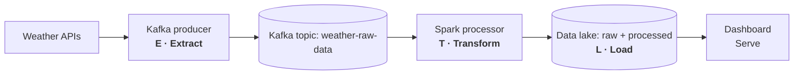

```mermaid
flowchart LR
  API["Weather APIs"] --> P["Kafka producer<br/><b>E · Extract</b>"]
  P --> T[("Kafka topic: weather-raw-data")]
  T --> S["Spark processor<br/><b>T · Transform</b>"]
  S --> L[("Data lake: raw + processed<br/><b>L · Load</b>")]
  L --> D["Dashboard<br/>Serve"]
```